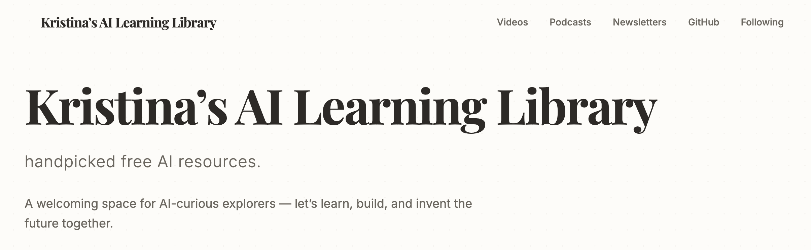

# Kristina's AI Library

A curated learning hub for AI-curious explorers.  
Handpicked free AI resources to help you learn, build, and explore the future.

🌐 Live site: https://kristina-ai-learning-library.vercel.app/  
🧩 Built with Google AI Studio  
🚀 Deployed on Vercel

## 📸 Preview

## ✨ About This Project

Kristina's AI Library is a curated resource hub designed to help beginners and enthusiasts discover high-quality AI learning materials in one place.

The goal is to reduce information overload and make AI learning more approachable through thoughtful curation.

This project serves as both:
- a personal knowledge hub
- a public learning resource
- a portfolio project

## 🚀 Run Locally

This project contains everything you need to run the app on your local machine.

### Prerequisites
- Node.js 

1. Install dependencies:
   `npm install`
2. Run the app:
   `npm run dev`

## ☁️ Run app in AI Studio
https://ai.studio/apps/fdba1c8c-630b-45dd-8d21-e27484b67f74
